## 📦 What is an Inventory Management System (IMS)?

An **Inventory Management System (IMS)** is a software solution that helps businesses **track, manage, and optimize inventory operations** across the entire supply chain.

IMS Extreme Admin Template is designed to handle real-world business workflows such as:

- 📊 Stock tracking and availability
- 🏬 Multi-warehouse inventory control
- 🧾 Sales & purchase order management
- 💳 Payments, expenses, and accounting
- 👥 Customer & supplier management
- 📈 Reports and analytics for decision-making

### Doc - https://ims.tecbricks.com/

## 🧩 IMS Core Modules Overview

IMS is organized into modular components that reflect real business processes:

- **Dashboard & Analytics** – Real-time overview of sales, inventory, and financial performance
- **Point of Sale (POS)** – Fast billing and checkout interface for retail environments
- **Products & Inventory** – Manage products, categories, brands, units, and stock levels
- **Customers & Suppliers** – Centralized management of business partners
- **Warehouses** – Multi-location inventory tracking and transfers
- **Orders & Transactions** – Sales orders, purchase orders, adjustments, and transfers
- **Accounts & Finance** – Payments, expenses, balances, and financial reports
- **Reports** – Detailed insights into inventory, sales, and operational performance
- **Settings** – System configuration and preferences

Each module is designed to be **scalable, customizable, and developer-friendly**.

# Screenshots

### 📊 Dashboard
A centralized overview showing key business metrics such as sales, inventory levels, revenue, and performance insights.

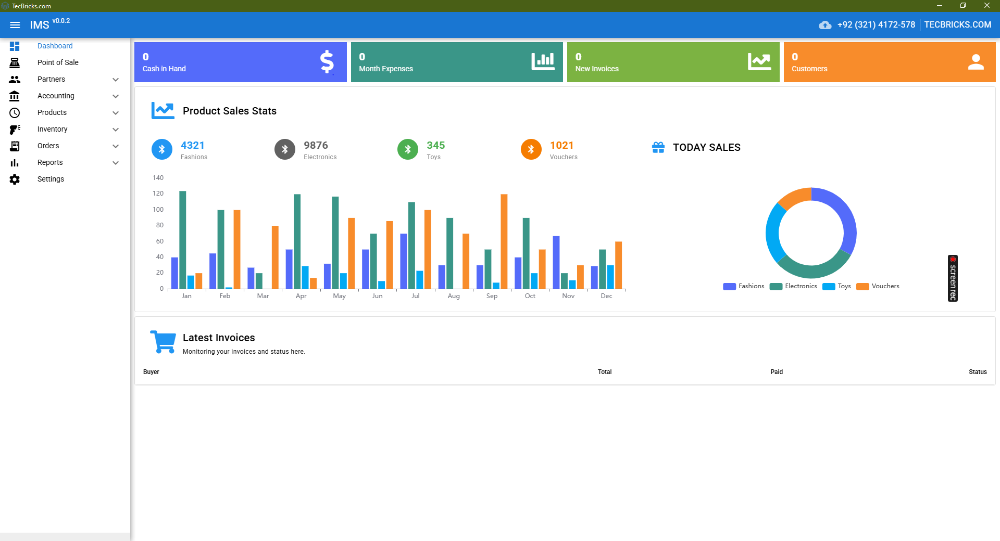

---

### 🧾 Point of Sale (POS)
A fast and intuitive POS interface designed for retail and counter sales, optimized for efficiency.

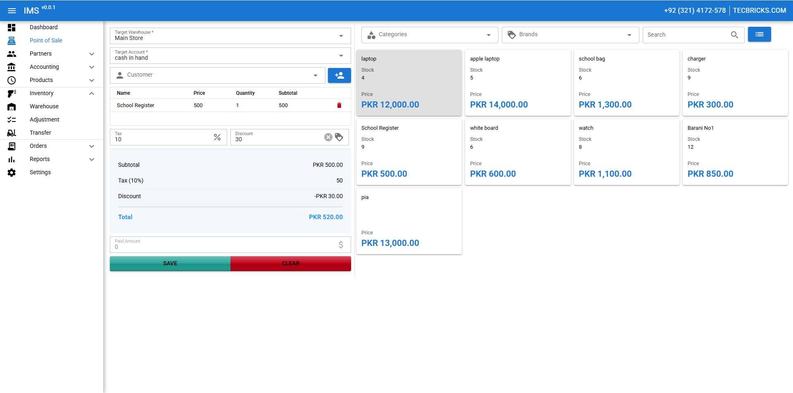

---

### 👥 Customers
Manage customer profiles, purchase history, and account balances in one place.

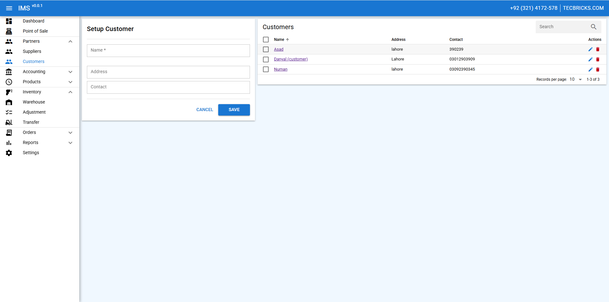

---

### 🏭 Suppliers
Track suppliers, manage purchase relationships, and maintain supplier records efficiently.

---

### 💼 Accounts
View and manage financial accounts, balances, and transaction summaries.

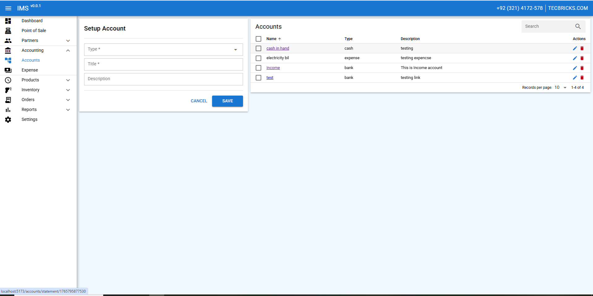

---

### 💸 Expenses
Record and categorize operational expenses for accurate financial tracking.

---

### 💳 Payments
Manage incoming and outgoing payments with detailed transaction history.

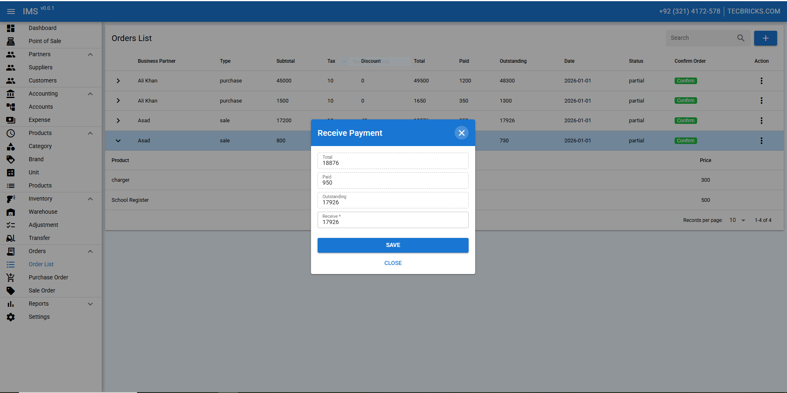

---

### 📦 Add Product
Create and manage products with pricing, stock levels, and categorization.

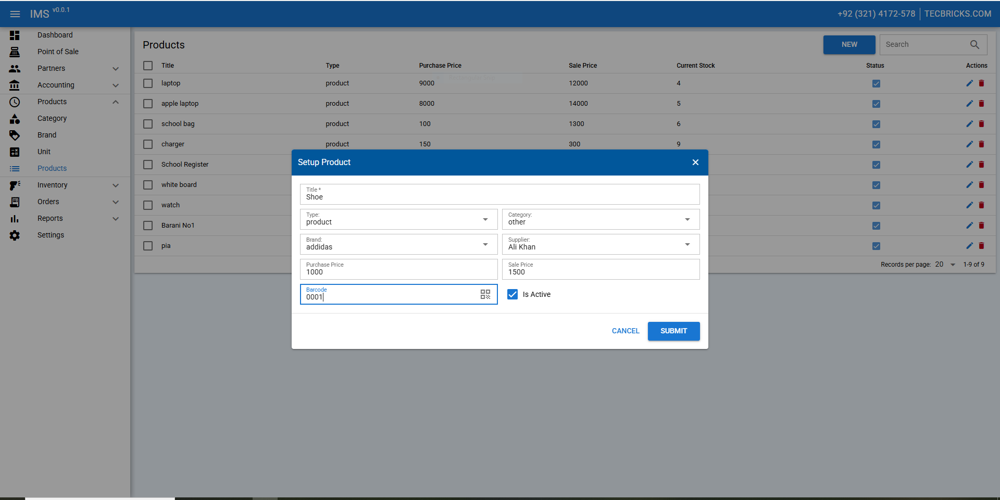

---

### 📋 Product Details
Detailed product view including stock movement, pricing, and warehouse availability.

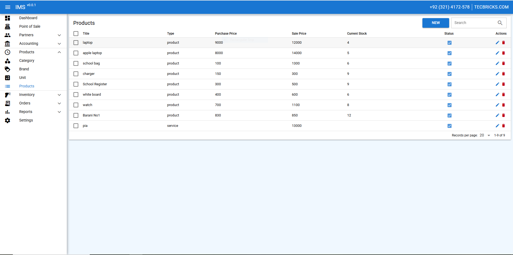

---

### 🏷 Brand
Manage product brands to keep inventory organized and searchable.

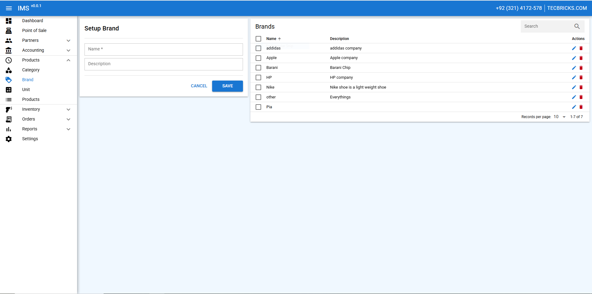

---

### 📏 Unit
Define measurement units such as pieces, boxes, kilograms, or liters.

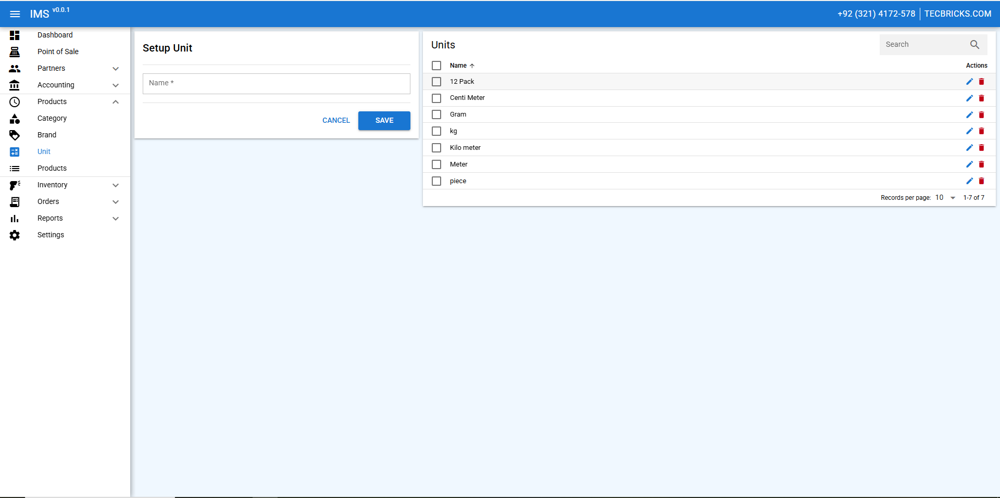

---

### 🗂 Category
Organize products into logical categories for better inventory control.

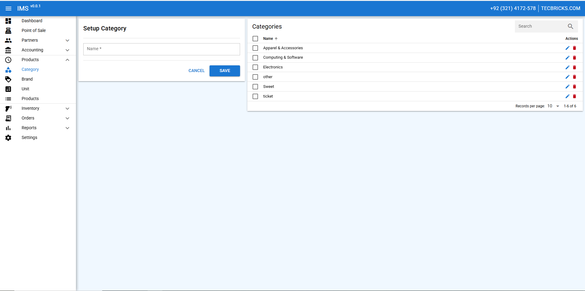

---

### 🏬 Warehouse
Manage multiple warehouses and track stock distribution across locations.

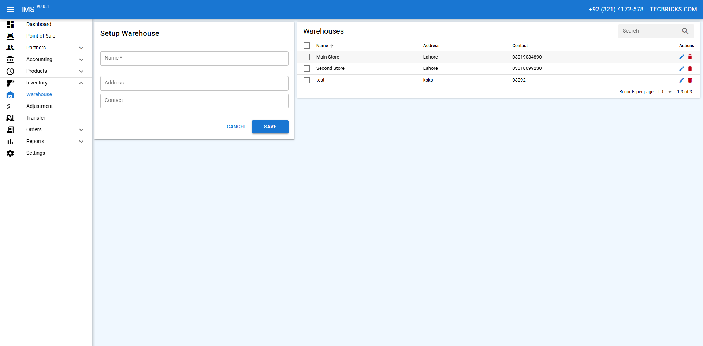

---

### 🔧 Adjustment
Handle inventory adjustments for damaged, lost, or corrected stock entries.

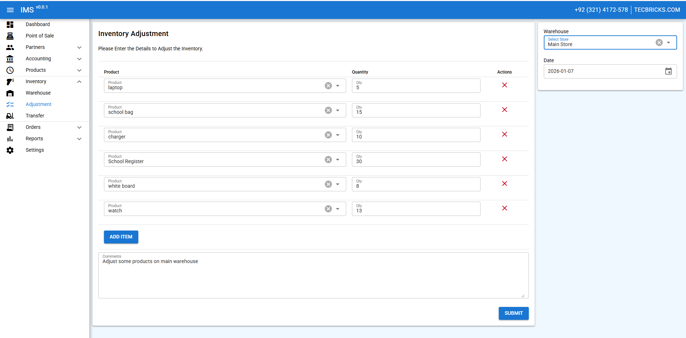

---

### 🔄 Transfer
Transfer stock between warehouses with proper tracking and logs.

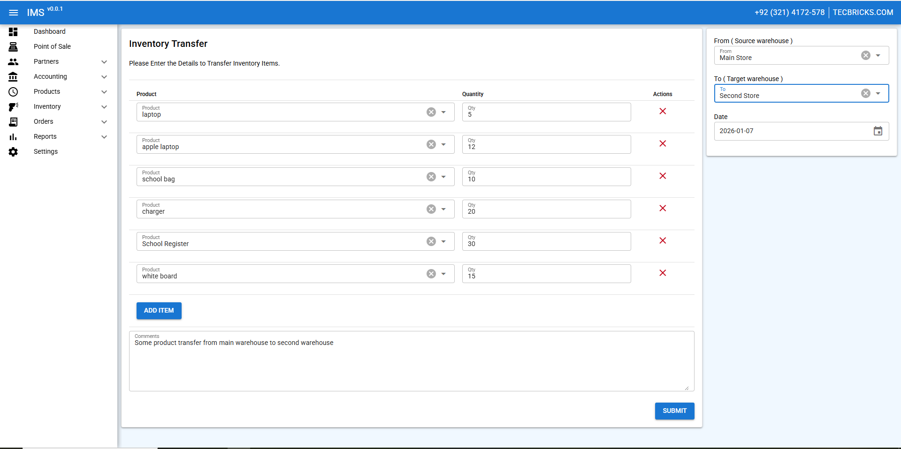

---

### 🧾 Orders List
View and manage all sales and purchase orders in one consolidated list.

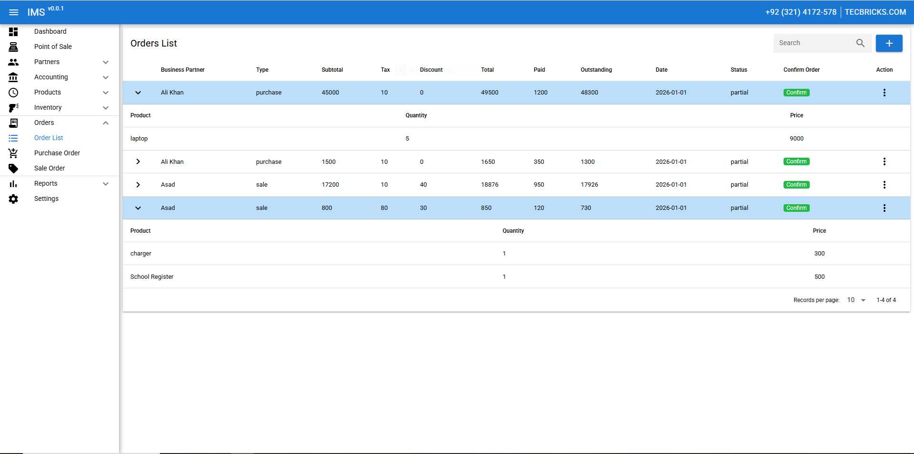

---

### 🛒 Purchase Order
Create and manage purchase orders for suppliers.

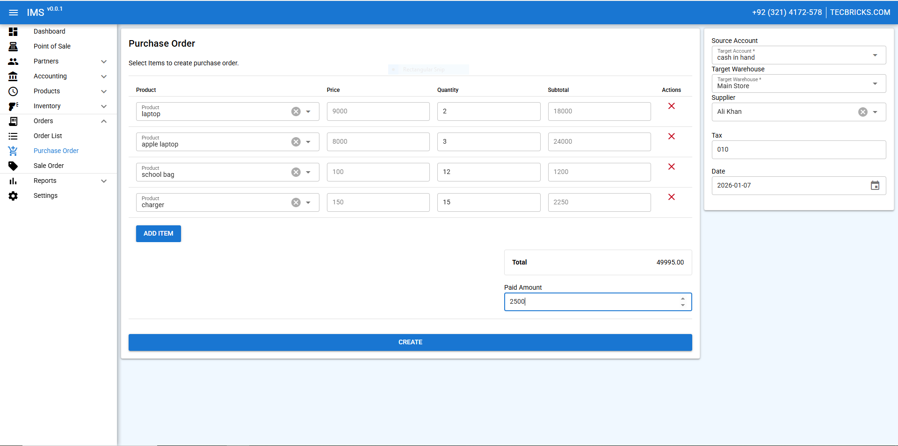

---

### 🛍 Sale Order
Manage customer sales orders with detailed tracking and status updates.

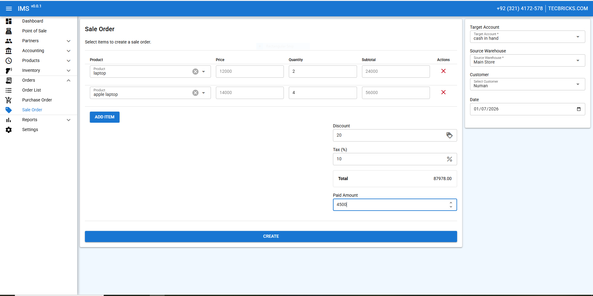

---

### 📈 Current Report
Analyze inventory, sales, and financial data through structured reports.

---

### ⚙️ Settings
Configure system preferences, roles, and application behavior.

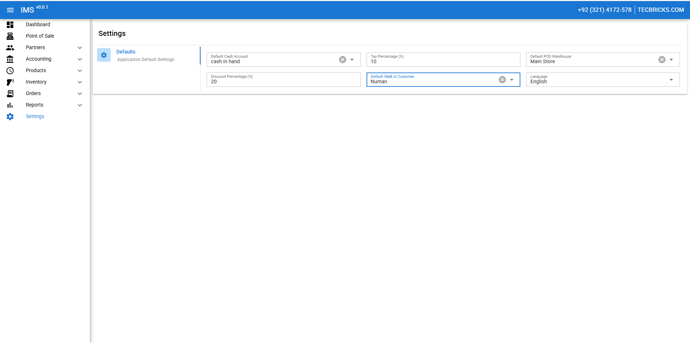